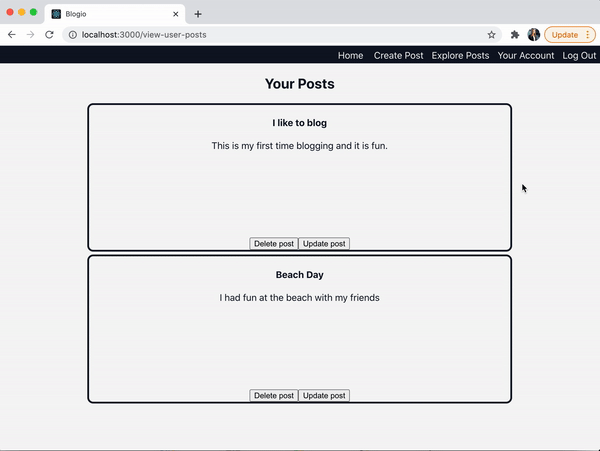

# Blogio

Blogio is a blog post web application.

### Contents
- [Tech Stack](#Techstack)
- [Features](#Features)
- [Testing](#Testing)

- Installation
- Features
- Demo Video
- Architecture Pattern
- Database Design
### Tech Stack<a name="Techstack"></a>
- Frontend: TypeScript, React
- Backend: TypeScript, Express, Node.js
- Database: Postgres, Sequelize-Typescript (ORM)
- Test Suite: Jest, Enzyme

### Features<a name="Features"></a>
- Ability to create an account, log in, and log out.

The navigation bar is conditionally rendered based on the user's login status. 


- CRUD Functionality
    - Create a new blog post
    

    - Read a blog post
    - Update a blog post
    

    - Delete a blog post

    Upon clicking the delete button, the ID of the post to be deleted is passed to the server, where I created an endpoint that utilizes sequelize-typescript to delete the post from the database. I also implemented cascading deletes in my datbase, so that deleted posts are also removed from the Favorites table and do not show up in any user's favorite posts.
    
- Search for blogs based on title or content
*** future: add filtering by update date, 

### Testing<a name="Testing"></a>
I implemented frontend unit tests using Jest and Enzyme.

To run the test suite from the frontend folder, run
```
npm test
```
