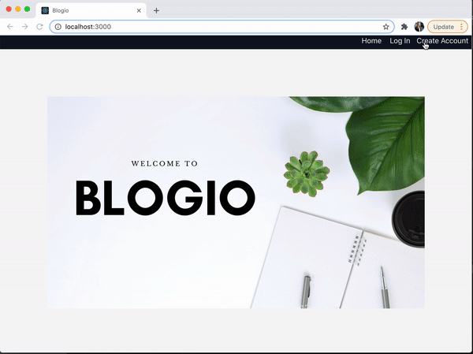

# Blogio

Blogio is an app that allows users to ......

### Contents
- [Tech Stack](#Techstack)
- [Features](#Features)
- [Testing](#Testing)

- Installation
- Features
- Demo Video
- Architecture Pattern

### Tech Stack<a name="Techstack"></a>
- Frontend: TypeScript, React
- Backend: TypeScript, Express, Node.js
- Database: Postgres, Sequelize-Typescript (ORM)
- Test Suite: Jest, Enzyme

### Features<a name="Features"></a>

### Testing<a name="Testing"></a>
I implemented frontend unit tests using Jest and Enzyme.

To run the test suite from the frontend folder, run
```
npm test
```
