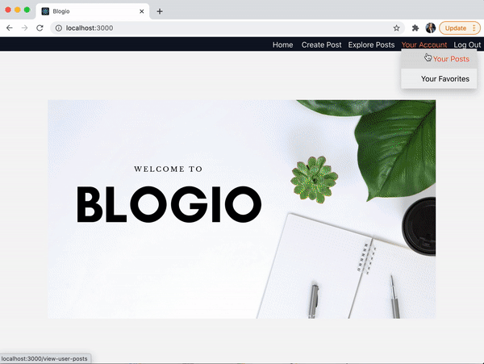

# Blogio

Blogio is a blog post web application.

### Contents
- [Tech Stack](#Techstack)
- [Features](#Features)
- [Best Practices](#Bestpractices)
- [Architecture Pattern](#Architect)
- [Database Design](#Database)
- [Testing](#Testing)

### Tech Stack<a name="Techstack"></a>
- Frontend: TypeScript, React
- Backend: TypeScript, Express, Node.js
- Database: Postgres, Sequelize-Typescript (ORM)
- Test Suite: Jest, Enzyme

This project was my first exposure to Typescript, Express/Node.js, and Sequelize-Typescript. I had a lot of fun diving into these technologies!

### Features<a name="Features"></a>
- **Ability to create an account, log in, and log out**
    - **Create an account:**
    I built a CreateAccount React component that renders a registration form. Through an onSubmit event, upon submission of the registration form, the username and password inputs are sent via an axios post request to the create_account endpoint in the server. Utilizing sequelize-typescript, a new record in the Users database is created with the username and password inputs. As a next step, I am interested in adding encryption for security when storing the passwords in the database.
    - **Log In:**
    The Login React component renders a login form. Upon submission of the form, the username and password inputs are sent to the login endpoint in the server, where I created a function that validates 1) if the username exists in the database and 2) that the input password matches the DB password. If both conditions are true, the user is logged in, their user ID is added to the express session, and the user is redirected to the homepage. The navigation bar is conditionally rendered based on the user's login status.
    - **Log Out:**
    Upon clicking the logout button in the navigation bar, the Logout component in React hits the logout endpoint in Express. The user is logged out, the express session is removed, and the conditionally-rendered navigation now shows the "pre-login" links.

    

- **CRUD Functionality**
    - **Create a new blog post**

    In the CreatePost React component, users enter blog post title and content. Upon submission of the post form, the title and content are sent to the create_post endpoint, where a new record in the Posts database is created. The post can then be viewed in the user's "Your Posts" page. This page uses the ViewUserPosts React component. Upon clicking the "View Your Posts" link in the "Your Account" dropdown on the navbar, a request with the user's ID is sent to the show_user_posts endpoint in the server. This endpoint queries the database for all Posts that match the user ID (user ID is a foreign key in the Posts table).
    

    - **Read and update blog posts**

    Users have the ability to read and update their blog posts. Through the UpdatePosts component, users can edit their post content. Through onSubmit in the update form, the updated content (and corresponding post ID) is sent to the update_post endpoint. This endpoint using a sequelize function to update the postContent stored in the DB for the selected post.
    

    - **Delete a blog post**

    Upon clicking the delete button, the ID of the post to be deleted is passed to the server, where I created an endpoint that utilizes sequelize-typescript to delete the post from the database. I also implemented cascading deletes in my database, so that deleted posts are also removed from the Favorites table and do not show up in any user's favorite posts.
    
- **Search for blogs based on title or content**
    I created SearchByTitle and SearchByContent components in React that render a search form. Upon submitting the search form, the search string is sent to the server, to search_by_title and search_by_content endpoints. These endpoints execute a sequelize query that converts the search term to lowercase and returns all Posts that include the search term. The matching posts are sent back to the client and are rendered with React cards. 

    In future development of Blogio, I plan to combine these search features onto one form, with users having the option to search by one or both of these fields. Additionally, with my current data model it is also feasible to implement search posts by post date or by username.   
    

- **Favorite Posts**
Users have the ability to favorite posts, as well as view the posts they have saved to their favorites. As users browse the posts, they can favorite multiple posts. In future development, I would like to have the favorite button be conditionally rendered in different colors based on if the user has favorited the post. On their Favorites page, users have the ability to view their favorites as well as to remove posts from their favorites. Similar to the delete post feature, the remove favorite button sends a request to the server to delete the record of the favorite post in the DB, and this deletion is executed with sequelize. 


### Best Practices<a name="Bestpractices"></a>
- During the development of this project, I focused on the big picture and user experience. I created the database model and created user stories on the first day of working on the project. This helped me to organize the necessary requirements and functionalities to build the app. Focusing on the big picture was integral for developing my project with intention and focus.
- I aimed to keep the structure of my files simple and organized. I created frontend and backend folders to organize my development. On the backend, I created a db folder, which stores the database model as well as a CRUD sub-folder, which breaks out database queries and operations based on their relevant table. My main server file references the content in these folders. This made my code cleaner than if I had created the database functions directly in my main server file. Additionally, on the front end, I created a Components folder where I stored individual React components. This project was my first time truly staying away from creating most of the frontend in a single React file. This made my code a lot simpler, organized, and easy to navigate.
- Through this project, I aimed to avoid repetitive code. The reusable components I built in React helped reduce reptition. As a developer, I am continually seeking to identify reptition and ways to refactor it. 

### Architecture Pattern<a name="Architect"></a>
I utilized a MVC architecture pattern for Blogio. I chose this pattern primarily because of the size of my app and my prior exposure and familiarity with the MVC pattern. Because Blogio was my first real exposure to TypeScript/Express/Node, it took me quite some time to set up my app so I wanted to select an architecture pattern  that I could easily get up and running quickly and effectively. 

### Database Design<a name="Database"></a>
The database includes 3 tables: Users, Posts, and Favorites.
- Users
    - id: number (primary key)
    - username: string
    - password: string
- Posts
    - id: number (primary key)
    - postTitle: string
    - postContent: string
    - createdAt: date 
    - userID: number (foreign key references User.id, Users:Posts is a 1:Many relationship)
- Favorites
    - id: number (primary key)
    - userID: number (foreign key references User.id, Users:Favorites is a 1:Many relationship)
    - userID: number (foreign key references Post.id, Posts:Favorites is a 1:Many relationship)


### Testing<a name="Testing"></a>
I implemented frontend unit tests using Jest and Enzyme. I plan to expand my test coverage as well as add backend tests in the future.

To run the test suite from the frontend folder, run
```
npm test
```
